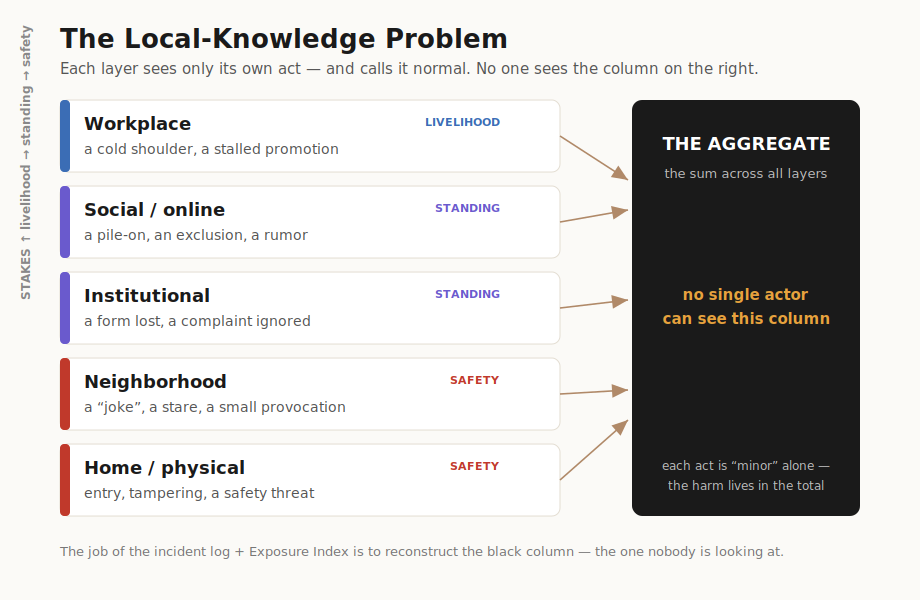
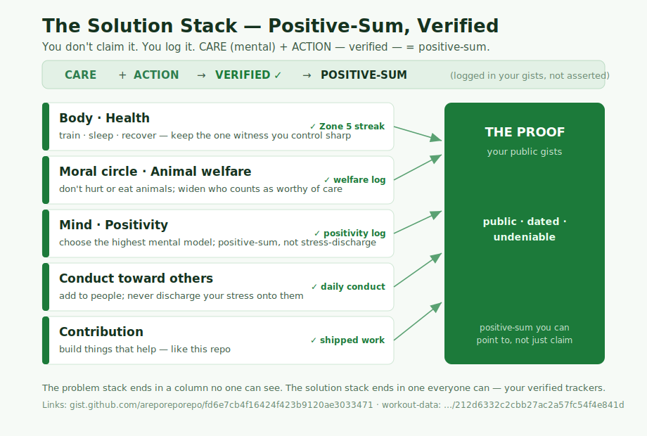

# Layered Security: The Local-Knowledge Problem

A framework for the kind of harm that no single person admits to causing — because
each person can only see their own layer, judges their own conduct in isolation,
and sincerely calls it normal.

> ### 👉 If this is happening to you, don't read the theory — take action.
> - **[START_HERE.md](START_HERE.md)** — crisis resources + your first steps (read this if you're overwhelmed).
> - **[PLAYBOOK.md](PLAYBOOK.md)** — pure checklist: NOW → today → this week → per-layer actions → repeat.
>
> Everything below is the *why*. You don't need it to start.

---

## The thesis

Serious harm to a person is rarely one big act. More often it's distributed across
**layers** — work, neighborhood, home, public space, institutions — where each actor:

1. **Has only local knowledge.** They see their own slice and nothing else.
2. **Judges their conduct in isolation.** "I just looked away." "I just didn't reply."
   "I just made a joke." Each act is defensible *alone*.
3. **Calls it normal.** Because in their layer, in isolation, it is.

No single actor holds the **aggregate**. So nobody feels responsible, and the standard
defense — *"that's not a big deal"* — is technically true at the level of one act and
catastrophically false at the level of the sum.

This is a well-documented failure mode under other names: **diffusion of responsibility**,
the **aggregation problem**, **death by a thousand cuts**. Naming it is the first move.
Making it *visible and accountable* is the rest.

Ordered by **stakes** — livelihood, then legal standing, then bodily safety — because
when a lower rung fails, the harm climbs:

```
   STAKES ↑          LAYER             a locally-"normal" act
   ─────────────────────────────────────────────────────────────
   livelihood        Workplace         a cold shoulder, a stalled promotion
   standing          Social / online   a pile-on, an exclusion, a rumor
   standing          Institutional     a form lost, a complaint ignored
   safety            Neighborhood      a "joke," a stare, a small provocation
   safety            Home / physical   entry, tampering, a safety threat
   ─────────────────────────────────────────────────────────────
                    ↑ each layer is blind to the others ↑
              THE AGGREGATE  ←  no one is looking at this column
```

The point of this repo is to **look at the column.**



## No coordinator required (read this before you read anything as a conspiracy)

The aggregate can *feel* coordinated. It almost never is. The honest mechanism:

- People act **emotionally and reactively**, discharging a feeling in the cheapest way their
  layer allows — a shrug, a look, a non-reply. To them it's nothing.
- It is **locally normal** and **consequence-blind**: they cannot see that their shrug lands
  on someone already being shrugged at in four other layers. The cross-layer cost is
  invisible *to them*, which is exactly why no one feels responsible.
- A thousand people each doing one thoughtless, locally-normal thing produces an aggregate
  that *looks* authored but **has no author**. Emergent, not coordinated.

This matters for two reasons. It's **more defensible** — you don't have to prove a conspiracy
you have no individual-level data for. And it's **more bearable** — you are not the target of
a hunt; you are under the aggregate of a society-wide *default*: react emotionally, optimize
your own layer, don't model the downstream. Careless, not coordinated. It still does real
damage — but naming it correctly is what keeps you both accurate and out of the paranoia trap.

The deeper root: the cheap move everywhere is **negative-sum** (discharge your discomfort onto
someone else); **positive-sum** building is costly and slow, so most people default to the
cheap one. You landed under the sum of those defaults. That's the problem to name — not a
network of enemies.

---

## The other half: the Solution Stack

Naming the problem isn't the contribution. **This is.** If the harm is "many people each doing a
small, unconscious, *negative-sum* thing," the answer is the same shape inverted: **one person
doing small, conscious, *verified* positive-sum things.** And you don't announce it — you log it.

> **CARE (mental) + ACTION — verified — = positive-sum.**



The keystone is **animal welfare**, and here's why it's not a side cause: the harm runs on
**tribalism** — a group bonding by casting someone *out*. Expand your circle of care all the way
to animals, the most "out" of all out-groups, and **there's no out-group left to anchor the tribe
on.** It dissolves the substrate the whole harm mechanism rests on. Paired with **health** (Zone 5)
— maintaining the one node you control — you get the antidote built from the same parts as the
poison, and both are *verified by what you do*, logged in public gists.

- **[SOLUTIONS.md](SOLUTIONS.md)** — the full stack, the tribalism keystone, and links to the trackers.
- **[docs/solution-layers.md](docs/solution-layers.md)** — each solution layer in depth, and which problem-mechanism it dissolves.

---

## Two things this framework does

### 1. Sets the standard explicitly, per layer
Each layer's actors hide behind "I didn't know." So we write down, per layer, what is
acceptable and what crosses the line. Once it's explicit, ignorance stops being a defense.
See [`docs/layers.md`](docs/layers.md).

### 2. Makes the aggregate visible
The one thing no layer can see is the sum. So we log it — dated, factual, neutral — until
the pattern is undeniable to someone with the power to act on it (HR, a lawyer, police, a
court, an oversight body). A feeling is not actionable. A timeline is.
See [`docs/incident-log-template.md`](docs/incident-log-template.md).

---

## How to actually use this

| If you are... | Start with |
|---|---|
| Experiencing this and want to act | [`docs/incident-log-template.md`](docs/incident-log-template.md) — log today. Evidence is the highest-leverage first move. |
| Trying to decide if a behavior crosses a line | [`docs/layers.md`](docs/layers.md) — the per-layer standards |
| Ready to escalate | [`docs/escalation.md`](docs/escalation.md) — the right channel per layer, with real organizations |
| Building your own baseline | [`docs/baseline.md`](docs/baseline.md) — the layer that protects your judgment under stress |
| Curious about the AI-safety bridge | [`docs/ai-safety.md`](docs/ai-safety.md) — the same structure as distributed harm / scalable oversight in frontier AI |
| Ready to be part of the solution | [`SOLUTIONS.md`](SOLUTIONS.md) + [`docs/solution-layers.md`](docs/solution-layers.md) — verified positive-sum practice, anchored on animal welfare + health |

---

## An honest note from the author of this scaffolding

This framework is strongest as a tool for **documentation and accountability** — turning
vague, totalizing dread into specific, dated, escalatable facts. That's its real power.

It is **weakest, and can become harmful, when used to confirm that *everyone* is
coordinating.** Diffuse harm is real; so is the human tendency, under sustained stress, to
read coordination into noise. The incident log is the test for both: if you log it and a
genuine pattern emerges, you now have the evidence to act. If you log it and it doesn't
hold together, that's information too — and worth talking through with someone you trust,
including a doctor, because carrying a sense of being targeted *everywhere* is itself a
heavy load that deserves support, not just a spreadsheet.

The log doesn't just build a case. It keeps you honest with yourself. Both matter.
