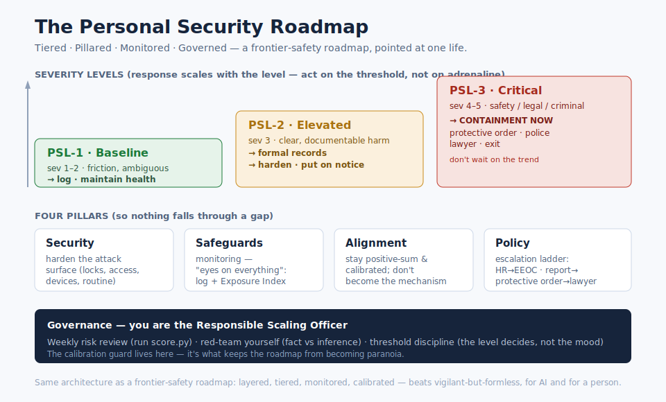

# The Roadmap

Personal security, structured exactly like a frontier-safety roadmap. The mental model is the
contribution: instead of a vague sense of being unsafe, you get **tiered levels, four pillars,
monitoring, and governance** — the same architecture used for the hardest risk-management problem
in the world, pointed at the layers of one life.

(Built in the shape of Anthropic's
[Responsible Scaling Policy roadmap](https://www.anthropic.com/responsible-scaling-policy/roadmap).)

---

## Personal Security Levels (PSL) — the severity ladder

Like ASL capability thresholds: **the response scales with the level, and crossing a threshold
*triggers* a defined set of safeguards.** You don't over-respond to friction or under-respond to a
real threat. Severity is scored in [`docs/scoring.md`](docs/scoring.md).

| Level | Trigger (severity) | What it means | Required safeguards (if-then) |
|---|---|---|---|
| **PSL-1 · Baseline** | sev 1–2 | Friction, passive slights, ambiguous | Log everything. Maintain health baseline. No escalation yet — build the record. |
| **PSL-2 · Elevated** | sev 3 | Clear boundary harm, documentable | Formal written records. Harden the relevant pillar. Put the responsible party/channel on notice. |
| **PSL-3 · Critical** | sev 4–5 | Safety, legal, or criminal | **Containment now**, don't wait on the trend: protective order, police, lawyer, and/or exit. |

The rule, borrowed straight from the RSP: **define the safeguard *before* you hit the level, so
you act on the threshold instead of on adrenaline.**

---

## The Four Pillars

Mirroring the roadmap's Security / Safeguards / Alignment / Policy — so nothing falls through a gap.

### 1. Security — harden the attack surface
Reduce exposure across layers: locks and entry (re-key, sensors, cameras), access control (who has
keys, passwords, recovery), devices (check for stalkerware), and routine/schedule exposure.
→ vocabulary in [`docs/lexicon.md`](docs/lexicon.md).

### 2. Safeguards — monitoring & "eyes on everything"
One searchable record across every layer, scored into an aggregate no single actor can see.
→ [`incidents.csv`](incidents.csv) + `score.py` → the Exposure Index ([`docs/scoring.md`](docs/scoring.md)).

### 3. Alignment — stay positive-sum and calibrated
Keep yourself clear, and don't become the mechanism. The verified solution stack (health, animal-
welfare keystone, high mental model, decent conduct) plus the over-detection guard — governed by a
written personal **constitution** and a weekly critique-and-revise loop (Constitutional AI, for a
person).
→ [`CONSTITUTION.md`](CONSTITUTION.md) + [`SOLUTIONS.md`](SOLUTIONS.md) + [`docs/baseline.md`](docs/baseline.md).

### 4. Policy — the external escalation ladder
The regulatory ladder, scaled to the layer: HR → EEOC/state agency; non-emergency report →
protective order → lawyer; institution → the body above it.
→ [`docs/escalation.md`](docs/escalation.md) + [`PLAYBOOK.md`](PLAYBOOK.md).

---

## Governance — you are the Responsible Scaling Officer

The roadmap only works with oversight that keeps it honest:

- **Weekly risk review** — run `python3 score.py`, read the trend, decide the current PSL.
- **Calibration / red-team yourself** — separate fact from inference; actively try to *disprove*
  the pattern. If the score climbs but the evidence column stays empty, that gap is the finding —
  the [over-detection trap](docs/the-mechanism.md#the-guard-read-this), not a conspiracy.
- **Threshold discipline** — when severity crosses into PSL-3, trigger containment even if it feels
  like "too much." The level decides, not the mood.

---

## Why this mental model is the right one

- **Tiered** → proportionate response; no panic at sev-1, no paralysis at sev-5.
- **Pillared** → hardening, monitoring, self, and external action are all covered.
- **Monitored** → the aggregate becomes visible and quantified.
- **Governed** → a built-in honesty check stops it from becoming paranoia.

It's the same reason the framework works for frontier AI: layered, tiered, monitored, and
calibrated beats vigilant-but-formless every time. Start at [`START_HERE.md`](START_HERE.md);
run it like a roadmap from there.
